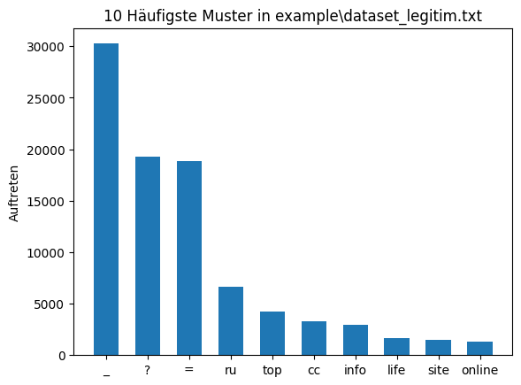

# Boyer-Moore-Algorithmus
Im Rahmen der Hausarbeit **Teilstring-basiertes Pattern Matching zur Erkennung von Phishing-URLs, _Untersuchung der Effektivität des Boyer-Moore-Algorithmus_** habe ich die C++-Implementierung des Boyer-Moore-Algorithmus von [Wikipedia](https://de.wikipedia.org/wiki/Boyer-Moore-Algorithmus) in Python portiert und um die Suche in `.txt` Dateien erweitert. Zur Effizienzsteigerung werden sowohl die Muster als auch der zu durchsuchende Text vorverarbeitet, bevor der eigentliche Vergleich beginnt.

Das Ziel dieser Implementierung ist es, mehrere Datensätze – bestehend aus Phishing- und legitimen URLs – zu durchlaufen und relevante Muster zu identifizieren. Die ermittelten Ergebnisse werden anschließend getrennt analysiert, interpretiert und visualisiert.

--------------------
## Installierung

Die Installierung erfolgt mit `pip`

```sh
pip install boyer-moore-algorithmus
```
und kann dann ganz einfach in python importiert werden
```python
import boyer_moore_algorithmus as boyer
```

<details><summary><b>Requirements</b></summary> 
    
Das Packet benötigt eine Reihe an andere Packete um ohne Probleme zu funktionieren, diese in der `requirements.txt` aufgelistet. Sie 
können diese Anforderungen ganz einfach installieren:
```sh
pip install -r requirements.txt
```
</details>

## Funktionen
Die Funktionen sind auf "bereinigte" Datensätze ausgelegt. Also `.txt` Dateien die entweder nur Phishing oder legitime URLs beinhalten.
Die folgende Version nutzten alle folgende `Liste`:

```python
list_of_patterns = [
    "http://","@","?","=","_","confirm","account",
    "banking","secure","webscr","login","signin","top","xyz",
    "cn","info","shop","online","sbs","ru","lol","site","cfd"
    "club","bond","live","cc","life","click","paypal"
]
```


### Normaler Boyer Moore Algorithmus 

Die Hauptfunktion `boyer_moore` braucht `.txt` Datei und eine `Liste`
von Muster. Ein `string` funktionert auch als Muster, dabei ist jedoch zu beachten, dass hier jedes Zeichen als eigenes Muster genommen und nicht der komplette `string`. 

Es wird einmal die eingegebene List von Muster, die Anzahl wie oft jedes Muster gefunden wurde und wie viele URLs als Phishing "makiert" worden sind zurück geliefert.

```python
list_of_patterns, occurrences_of_pattern, total_hits = boyer.boyer_moore("example\dataset_phishing.txt",list_of_patterns)
-----------------------------------------------------------------------
>>> Anzahl von jedem Muster: [4416, 2487, 57613, 58153, 40150, 3373, 7422, 628, 9231, 12980, 38567, 1920, 4545, 1159, 8397,
                             11323, 1739, 4952, 148, 24877, 340, 12161, 0, 57, 1015, 20146, 552, 1068, 19604] 

>>> Gefunde Phishing URLs: 87959
```

### Zeitmessung Boyer Moore Algorithmus 

Hier wird eine Zeitmessung durchgeführt. Sie stoppt die Zeit zwischen jedem Eintrag in der `.txt` Datei und wartet dann eine Sekunde.
Zubeachten ist, dass es sich empfiehlt einen kleinern Datensatz zu nutzen. In `example.py` wird die Zeitmessung mit `dateset_timed.py` durchgeführt
dabei sind es nur 250 URLs die geprüft werden.

```python
list_of_patterns, occurrences_of_pattern, total_hits, timer = boyer.boyer_moore_timed("example\dataset_timed.txt",list_of_patterns)
-----------------------------------------------------------------------
>>> Anzahl von jedem Muster: [0, 0, 0, 0, 0, 0, 0, 0, 0, 0, 0, 0, 0, 0, 0, 0, 0, 0, 0, 0, 0, 0, 0, 0, 0, 0, 0, 0, 0] 
>>> Legitime URLs als Phishing makiert: 0 
>>> Die durchschnittliche Zeit für die Suche nach allen Musters innerhalb einer URL bzw. 50 URLs:
    (datetime.timedelta(microseconds=37), datetime.timedelta(microseconds=1850))
```

### Visualisierung Boyer Moore Algorithmus 

Eine schicke optische Darstellung der Ergebnisse von einem legitimen und einem phishing Datensatz. Zum einen eine Confusion Matrix und zum
anderen jeweils die _Top 10 Muster_ der `.txt` Dateien.

```python
boyer.boyer_moore_visualised("example\dataset_phishing.txt","example\dataset_legitim.txt",list_of_patterns)
```

<p float="left">
  
   
  
</p>


